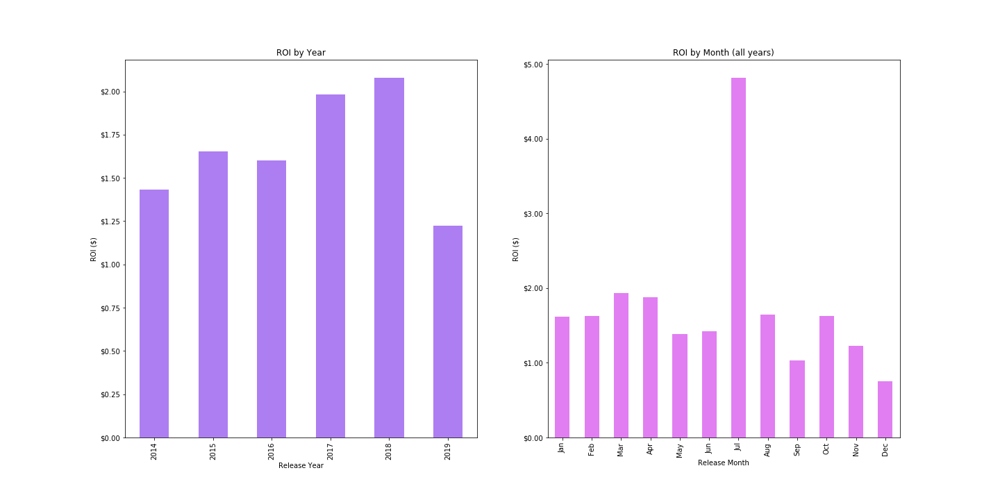
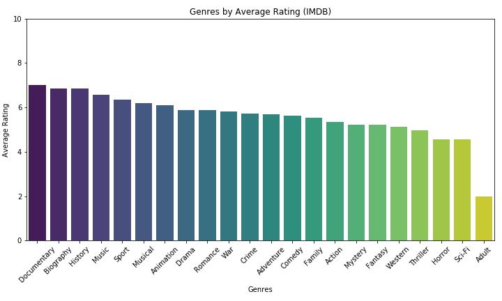
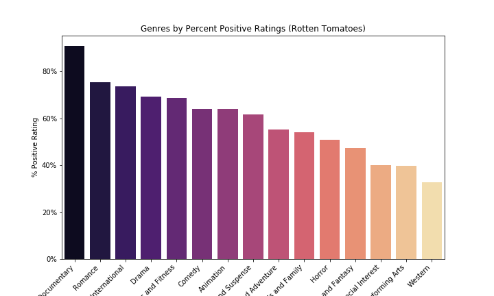

# Movie Data Analysis for Microsoft

**Author**: [Christie Sarver](mailto:christie.sarver@gmail.com)

## Overview

This project uses several sources related to movie releases and performance to define and analyze what makes a successful movie. It will display results that can be used in decision making for a movie studio creation venture.

## Business Problem

Microsoft is interested in developing original video content to remain competitive in the tech world by creating a movie studio. This project will examine the movie industry to provide a set of recommendations on where to get started. 

## Parameters

For the purposes of this analysis I have chosen to look at US market data only, and to examine only films that have been released in the past 10 years. This decision is based on the context of how much the film and tv industry has changed in the past decade with the entry of streaming services as major movie studio contenders. 

## Data

Several data sets have been explored, but the following are included in the results:

* IMDB
* Rotten Tomatoes
* The Numbers

## Measures of Success

* Positive return on investment: Because ultimately, a successful business venture makes money.
* High user ratings: We want people to like the movie! This will (hopefully) help generate word-of-mouth promotion and social media chat to spread positive opinion.
* High critical ratings: Strong critical reviews mean positive press, which will capture media attention. Having clout in the industry as well can mean getting put up for awards, which can be a great set up to draw in better talent to future films, and better funding from potential investors


## Results

Movies that are released in July have the biggest return on investment. The majority of successful movies have a budget below $50M, so this can be used as a benchmark.



User ratings are high for non-fiction genres like Biography, Documentary, History & Sport. Music and musical are also popular.



Documentary, Romance, Art House/International, and Drama films are popular with critics. These genres may not be as clearly linked, but thinking about what they are not (Comedy, Action, Sci Fi/Fantasy, Horror) will help us understand what to steer away from.




## Conclusions

This analysis leads to the below recommendations for getting started with developing movies:

* Release a movie in July for the biggest return on investment. A variety of movies from different genres all performed well as July releases
* Start with a budget below $50MM since most movies with high returns fell at or below this. You don’t need to pour hundreds of millions of dollars into a huge franchise to be successful

* People have high opinions of non-fiction genres like Biography, Documentary, History & Sport – consider these genres for a first venture. Non-fiction genres are having a moment on streaming services, and the prevalence of the true-crime genre may have renewed the appetite for real-life stories

* Documentary, Romance, Art House/International, and Drama were overall popular with critics. These genres may not be as clearly linked, but thinking about what they are not (Comedy, Action, Sci Fi/Fantasy, Horror) will help us understand what to steer away from


## Next Steps

For further analyis, recommended approaches are below:

* An analysis on press/awards for different titles and studios and how this has affected revenue, particulary new entries such as Netflix and Amazon Prime Video
* A market research analysis of the movie industry during Covid-19, and how established players are adapting to this challenging environment

## For More Information

See the full analysis in the [Jupyter Notebook](./Movie%20Analysis%20Notebook.ipynb) or review this [presentation](./Movie%20Data%20Analysis%20Presentation.pdf).

## Repository Structure

```
├── Backup Work
├── Images
├── Data
├── Movie Analysis Notebook.ipynb
├── Movie Data Analysis.pdf
├── README.md
└── Movie Data Analysis Presentation.pdf
```